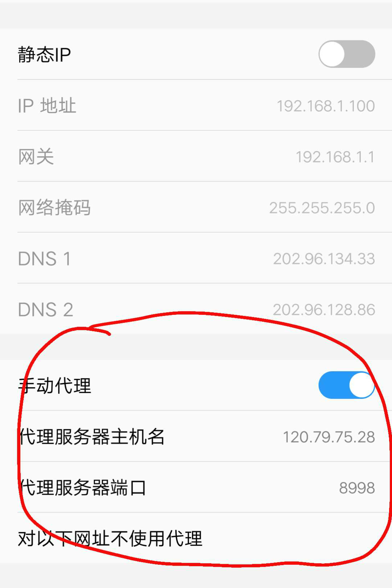
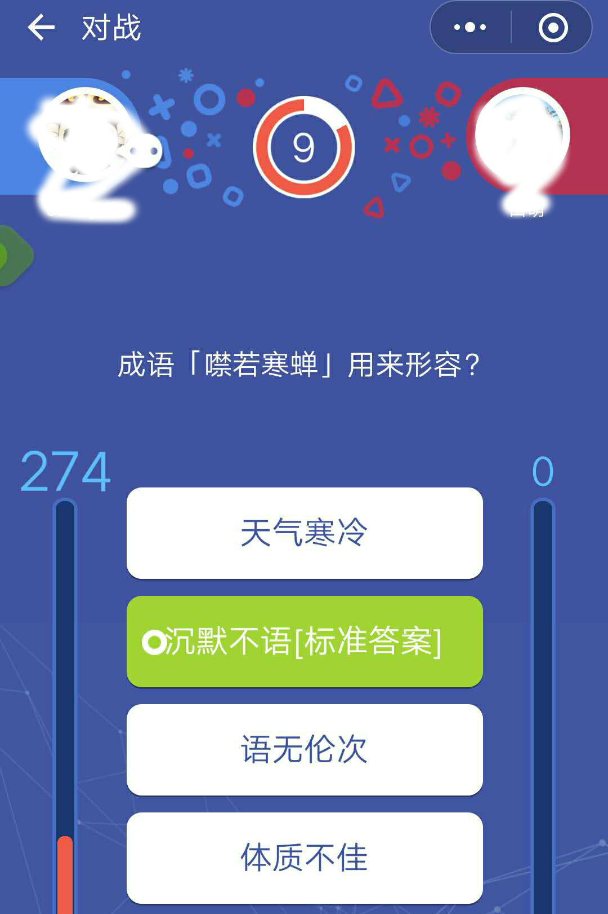
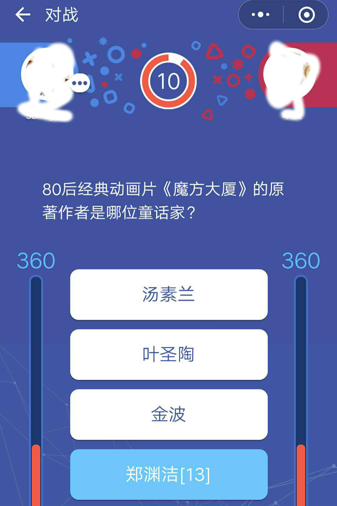

# WeChat_TouNaoWangZhe
Automatically connect your WeChat'S WangZheTouNao Mini Program with the local question pools.

## How to use
	
1. Install the certificate on iPhone. [It's safe so don't worry]
   Use your cell phone browser and go to: https://github.com/AlexTRee/Bots/blob/WeChat_TouNaoWangZhe/certs/goproxy.crt
   If you are using iPhones, you need to trust the certificate. You have to do 2 things:
   	1>. Go to Settings -> General -> Profiles & Device Management -> githb.com/coreos/goproxy -> install the certificate.
	2>. Go to Settings -> General -> About -> Certificate Trust Settings -> enable 'githb.com/coreos/goproxy' (turns green)

2. Set up iPhone Proxy (Android phone should be similar)
   Connect wifi. Then go to Settings -> Wifi. Click the Wifi you are using, go to the 'HTTP Proxy', Configure Proxy.
   Then select 'Manual', type your server's IP address (which can be seen from your Wifi settings). put 8998 in Port field. Click SAVE.

    
 

 

3. To run.
   After you connect Wifi. download the question pool program on your computer.
   Go to [release](https://github.com/AlexTRee/Bots/tree/WeChat_TouNaoWangZhe/releases), download the program that fits your OS. Unzip.
   Click brain.exe (on Windows OS)
4. While brain.exe is running on your computer, make sure your phone is connected Wifi with Proxy you set up in step 2.
   Open WeChat, open WangZheTouNao. Now you will see the difference!
5. The correct answer is marked【ANSWER】or【A Number】, note that not always the highest number = correct answer! So if you see multiple options have different number, make your own judgmental call.  

 
 

## Merge Question Pool
- Please submit your own question file (questions.data file) to [Here](https://github.com/sundy-li/wechat_brain/issues/17), the question pool will be constantly merged and updated. 

